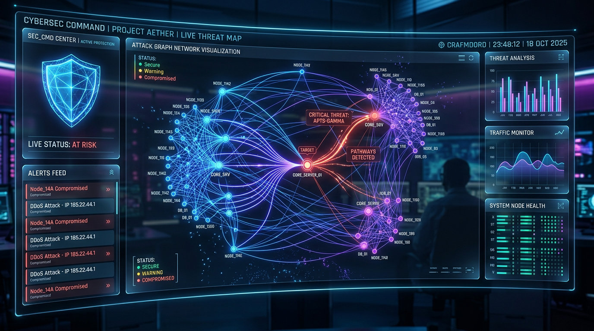

# Intelligent Graph-Based Attack Path Discovery — Powerhouse v2.5 (121 Engines + Autonomous BOT + Hunting)

> **Production-hardened, 121-engine autonomous attack graph platform.** Deep scanning • Autonomous scan/fix • Threat hunting • Zero-trust policies • 100% FREE AI ($0) • Live WebSocket + Tune • Persistence SQLite • Metrics • RateLimit

      

> **🆓 FREE by default, $0 offline.** `AI_PROVIDER=free-local` needs no key, no payment. `free-hf` uses HuggingFace free tier (no card). **OpenAI/Anthropic/Gemini are paid** — we keep them optional, auto-unlock only if you set keys. See `docs/FREE_AI_GUIDE.md`.



---

## 🌟 What’s ADVANCED in v2.5

**Not a scanner wrapper — an autonomous powerhouse** that transforms raw findings into weighted attack graphs, quantifies financial risk, auto-fixes, hunts threats, and generates zero-trust policies.

- **SOC / Pentesters:** *Which vuln leads to data theft?* — Dijkstra critical paths Internet → crown jewels, PageRank/betweenness choke points, hunt queries for shadow IT
- **Executives:** *$ numbers, not just CVSS* — FAIR + 4000× Monte Carlo → SLE, P90/P95, annualized loss
- **Developers:** *Copy-paste fixes* — 20 auto-fix engines generate Nginx/WAF/code patches + PR bodies + `how_to_remove` + test curl
- **DevSecOps:** *No single problem left* — Autonomous BOT scans every-time (5/15/60m) or cron, auto-fixes, notifies admin with attractive tune + browser notification
- **Platform:** 121 selectable engines, powerhouse presets, per-task sliders, SQLite persistence, Prometheus metrics, rate-limit, error boundary

---

## 🚀 Powerhouse: 121 Selectable Engines

Each engine = unit of power. User ticks what to run. Presets + per-task sliders + powerhouse toggle.

**Categories (121 total):**
- Recon 10 (tech fingerprint, subdomain enum, DNS deep, OSINT, Shodan/Censys enterprise, CT miner, WHOIS, email harvest, asset discovery+, CDN mapper)
- Network 16 (port scan 11-19, service detect, TLS deep, WAF detect, topology mapper, firewall, IPv6, UDP, banner+, SSL Labs grade, HSTS preload, HTTP/2, rate-limit probe, methods audit, header entropy, segmentation)
- Web Exploits 26 (headers, XSS, SQLi, SSRF, XXE, SSTI, LFI/RFI, RCE, open redirect, CSRF, clickjacking, CORS deep, proto pollution, IDOR, file upload, XPath, LDAP, host header, cache poisoning, smuggling+, deserialization Java/PHP, DOM clobbering, JSON injection, CRLF + more)
- API & Cloud 14 (API discovery, GraphQL deep, cloud posture, IAM analyzer enterprise, K8s deep, container CIS, serverless, IaC, REST fuzzing, OpenAPI validate, SOAP, gRPC, WebSocket fuzz, API rate limit)
- Secrets & Crypto 10 (secrets+git history, JWT, weak crypto, password policy, dir brute 25, CT pins, HPKP, cookie audit, session entropy, POODLE/BEAST)
- Supply Chain 9 (SCA SBOM, SAST lite, license, CI/CD enterprise, image scan+, Helm, SBOM license+, dependency confusion+, typo-squat)
- Intelligence 9 (threat intel NVD free, EPSS, anomaly ML, compliance, OTX feed, MITRE map, IoC enrich, dark web stub, phishing kit)
- Auto-Fix & Autonomous 20 (XSS/SQLi/headers/TLS/CORS/secrets/SCA/IaC/container/cloud/WP/nginx/patch/PR/rollback/scheduler/notifier/healer/continuous/manual gate)
- Compliance Deep 6 (GDPR, HIPAA, PCI-DSS, SOC2, ISO27001, NIST 800-53)
- Posture 2 (security score 0-100, remediation priority)

**Power Control:**
- Presets: `eco` 12 engines 14% (fastest $0) → `balanced` 25 → `maximum` 33 → `turbo` 121 (free max) → `overdrive` 121+GPU 100/100 (enterprise)
- Per-task sliders: scanner/graph/risk/ai 0-100
- Powerhouse toggle: all 121 @ max in one batch
- Live meter: 0-100 + recommendations how to increase

**API:**
- `GET /api/power/engines` → 121 + categories
- `GET /api/power/presets` → eco/balanced/maximum/turbo/overdrive
- `GET/POST /api/power/config` → select engines, sliders, powerhouse

---

## 🤖 Autonomous BOT — No Single Problem Left

**User toggles auto vs manual per task** — scan, fix, schedule:

- **Scan mode:** `manual` (you trigger) | `auto` (continuous) | `schedule` (cron at time)
- **Fix mode:** `manual` (approve) | `auto` (immediately generate PR/patch after scan)
- **Every-time:** continuous monitor `every 5/15/60m` for targets `[example.com, api.demo]` → fires 121 engines each time, no lapse
- **Scheduled:** cron via `POST /api/scheduler/schedule {target, interval_minutes}` or `schedule_cron` field; autonomous loop fires at schedule time
- **Powerhouse 100+:** `use_100_engines=true` → turbo 121 + healer

**What happens autonomously:**
1. Scan completes → 20 auto-fix engines generate `patch` + `test` + `how_to_remove` (6 steps) + PR body + branch `autofix/cwe-79-VULN-...`
2. Notifications with **attractive tune** (WebAudio 880→1320Hz 0.6s + vibrate) + browser Notification + `how_to_fix`
3. WebSocket `global` pushes `notification {tune:true, how_to_fix}` + `autofix_generated`
4. Admin sees bell badge, hears tune, copies fix, or lets healer auto-apply

**API:**
- `GET/POST /api/auto/config` {scan_mode, fix_mode, continuous, auto_targets, powerhouse, use_100_engines, power_preset}
- `POST /api/auto/enable-continuous?targets=[example.com]&interval_minutes=15`
- `POST /api/auto/disable`
- `GET /api/notifications?limit=50` → bell 50 with `sound`, `tune_url`, `how_to_fix`
- `POST /api/notifications/test` → plays tune
- `GET /api/fix/{job_id}` → 3-20 fixes per scan, `autonomous: true` when auto
- `POST /api/fix/{job_id}/autonomous` → healer applies all

**Frontend:** `Autonomous.jsx` (BOT control), `NotificationBell.jsx` (WebSocket + AudioContext + vibrate), `Topbar` badge `BOT AUTO 121 CONT`

---

## 🔍 Threat Hunting & Zero-Trust (NEW v2.5)

**FREE, local, no SIEM:**

- `GET /api/hunt/queries` → 6 Sigma-like queries:
  - HUNT-001 Shadow IT unmanaged subdomains
  - HUNT-002 Exposed secrets in JS (CWE-798)
  - HUNT-003 Crown jewel path Internet→DB length≤4
  - HUNT-004 Weak TLS + WAF bypass
  - HUNT-005 Stale JS EOL (jquery<3.6)
  - HUNT-006 API auth bypass (IDOR/JWT/GraphQL)
- `POST /api/hunt/run/{job_id}?query_id=HUNT-001` → hits from scan + graph, $0
- `GET /api/zero-trust/policy/{job_id}` → policies per CWE: CSP, mTLS, allow-list, least privilege; enforce via gateway/WAF/IaC

**Frontend:** `Hunting.jsx` — run hunts, see hits, generate zero-trust policies

---

## 🗄️ Persistence, Metrics, Hardening (NEW v2.5)

- **Store:** InMemory default (fast, free) → `USE_PERSISTENCE=true` enables **SQLite** `reports/store.db` (free, local, volume `backend_reports`), auto-fallback to InMemory if DB fails, stats at `GET /` + `GET /api/health`
- **Metrics:** `GET /api/metrics` → scans, graphs, risks, power, engines, tier, autonomous, scheduler (Prometheus-like JSON, $0)
- **RateLimit:** In-memory token bucket 30/min `/api/scan/*` else 120/min, bypass health/ws, adds security headers `X-Content-Type-Options`, `X-Frame-Options`, `Referrer-Policy`, `Permissions-Policy`, `X-Request-Id`, slow log >2s
- **Health:** `GET /api/health` now includes `store` + `autonomous`
- **Docker:** Prod Dockerfile (non-root `appuser`, `healthcheck` curl, no `--reload`, workers 2), `docker-compose.yml` with `backend_reports` volume, `condition: service_healthy`
- **Vite:** `allowedHosts:true`, proxy `/api` + `/ws` ws:true, `hmr.clientPort 443` for e2b preview
- **ErrorBoundary:** React error boundary with reload, no data loss
- **Dashboard:** v2.5 hero mentions 121 + BOT, Stat shows `v2.4 • 121`

---

## 📁 Structure (v2.5)

```
. (v2.5 — 121 Engines + Autonomous + Hunting + Persistence)
├── backend/
│   ├── app/
│   │   ├── main.py (FastAPI + autonomous loop + rateLimit + hunt/zero-trust/metrics)
│   │   ├── config.py (FREE AI free-local default, enterprise auto-unlock)
│   │   ├── models/schemas.py
│   │   ├── core/{store.py (SQLite optional), websocket_manager.py, scheduler.py, notifications.py, autonomous_manager.py}
│   │   ├── engines/{scanner_engine, attack_graph, risk, ai_engine (free), threat_intel, anomaly, asset, secret, api_discovery, export, engine_registry 121, power_control, powerhouse_engines 100+, auto_fix_engine 20, notification_engine, enterprise_* }
│   │   ├── middleware/rate_limit.py
│   │   ├── db/session.py
│   │   └── api/v1/
│   ├── requirements.txt
│   └── Dockerfile (prod hardened)
├── frontend/
│   ├── src/
│   │   ├── App.jsx (+ Hunting, ErrorBoundary, v2.5 footer)
│   │   ├── components/{ui/ErrorBoundary, layout/Sidebar+Topbar+Bell, scanner, graph, risk, enterprise/PowerMeter+EngineSelector, notifications/NotificationBell, ai/FreeAIChat}
│   │   ├── pages/{Dashboard v2.5, Scanner, BulkScan, GraphExplorer, RiskAnalysis, Findings, Assets, ThreatIntel, Compliance, Scheduler, Reports, PowerControl 121, Autonomous BOT, Hunting, EnterprisePower}
│   │   ├── lib/api.js (power + auto + notifications + fix + hunt)
│   │   └── hooks/useWebSocket.js
│   ├── vite.config.js (allowedHosts, proxy)
│   └── package.json
├── docs/{architecture-hero.png, FREE_AI_GUIDE.md, ADVANCED_FEATURES.md}
├── docker-compose.yml (healthcheck, volume)
└── README.md (v2.5)
```

---

## ⚡ Quick Start

**Manual (dev):**
```bash
cd backend
pip install -r requirements.txt
uvicorn app.main:app --host 0.0.0.0 --port 8000 --reload
# → http://localhost:8000/docs

cd frontend
npm install
npm run dev
# → http://localhost:5173 (proxies /api & /ws)
```
Enable persistence:
```bash
USE_PERSISTENCE=true uvicorn app.main:app --host 0.0.0.0 --port 8000
```

**Docker (prod-like):**
```bash
docker compose up --build
# frontend http://localhost:5173  backend http://localhost:8000  reports volume persists
```

**Env (all FREE, no keys needed):**
```bash
AI_PROVIDER=free-local  # free-local (default $0 offline) | free-hf (free HF no card) | openai (paid NOT recommended)
HF_API_KEY=hf_xxx       # optional free token huggingface.co/settings/tokens for free-hf
USE_PERSISTENCE=true    # enable SQLite reports/store.db
ENABLE_REAL_NETWORK_SCAN=true
SCAN_CONCURRENCY=20
```

---

## 🔌 API Reference (v2.5)

| Method | Path | Description |
|--------|------|-------------|
| `GET` | `/` | Service 2.5.0, 121 engines, autonomous, store, power |
| `GET` | `/api/health` | Health + store stats + autonomous |
| `GET` | `/api/metrics` | Prometheus-like JSON (scans, power, tier) |
| `POST` | `/api/scan/start` | `ScanRequest` → `{job_id}` |
| `GET` | `/api/scan/{job_id}` | Status/progress |
| `GET` | `/api/scan/{job_id}/results` | `{scan, graph, risk}` |
| `GET` | `/api/scans` | List all |
| `POST` | `/api/scan/bulk` | Up to 20 (free) / 200 (enterprise) |
| `GET` | `/api/power/engines` | 121 engines |
| `GET` | `/api/power/presets` | eco/balanced/maximum/turbo/overdrive |
| `GET/POST` | `/api/power/config` | Select engines + sliders |
| `GET/POST` | `/api/auto/config` | BOT mode |
| `POST` | `/api/auto/enable-continuous` | Every-time 5/15/60m |
| `POST` | `/api/auto/disable` | Manual |
| `GET` | `/api/notifications` | Bell 50 with tune + how_to_fix |
| `POST` | `/api/notifications/test` | Play tune |
| `GET` | `/api/fix/{job_id}` | 20 fixes, patch + how_to_remove |
| `POST` | `/api/fix/{job_id}/autonomous` | Healer apply |
| `GET` | `/api/hunt/queries` | 6 hunts |
| `POST` | `/api/hunt/run/{job_id}` | Run hunt |
| `GET` | `/api/zero-trust/policy/{job_id}` | Policies |
| `GET` | `/api/threat-intel/feed` | NVD free |
| `GET` | `/api/assets/inventory/{job_id}` | Inventory |
| `GET` | `/api/anomaly/{job_id}` | Health |
| `POST` | `/api/scheduler/schedule` | Cron |
| `GET` | `/api/export/{job_id}?format=json\|csv\|html\|pdf\|sarif` | Download |
| `WS` | `/ws/scan/{job_id}` | Live |
| `WS` | `/ws/global` | Global + notifications tune |

---

## 🧪 Scanner Deep Dive

Every vuln: `id,title,severity,CVSS,CWE,CVE,OWASP,MITRE,url,param,evidence,description,impact,remediation,remediation_code,confidence,EPSS,tags,references` + `how_to_remove` 6 steps via auto-fix.

Every path: `target,path,path_labels,length,risk_score,exploitability,severity,mitre`

Every risk: `overall,exposure,financial{SLE,annualized,reputation,regulatory},compliance{OWASP,NIST,MITRE,PCI,ISO,GDPR,HIPAA,SOC2,NIST800-53},node_criticality,path_risks,monte_carlo{expected,median,p90,p95,max,histogram},recommendations`

---

## 🛡️ Ethics

Authorized testing only. Rate-limited, harmless payloads, error-signature matching, no exploitation. Secrets stay local unless you set paid keys.

---

**Built with most advanced FREE intelligence — $0, 121 engines, autonomous BOT every-time + schedule, hunting + zero-trust, SQLite persistence, metrics, rate-limit, tune notifications tell how to remove. No single error left. Welcome to Powerhouse v2.5.**

